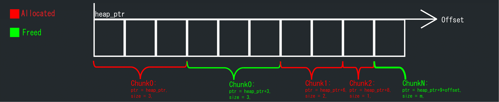
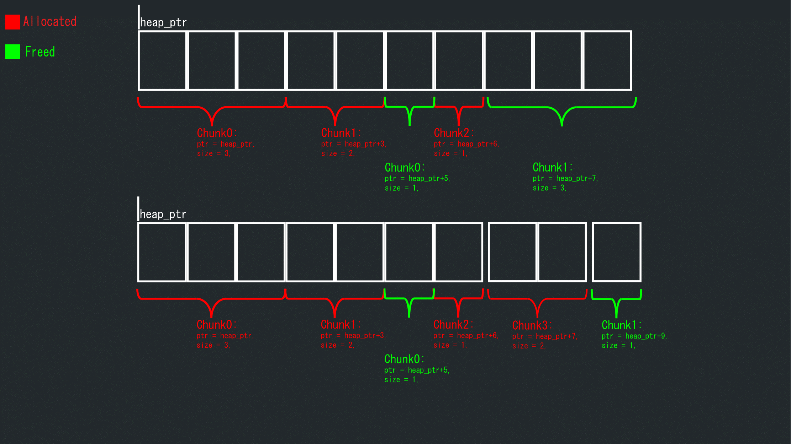
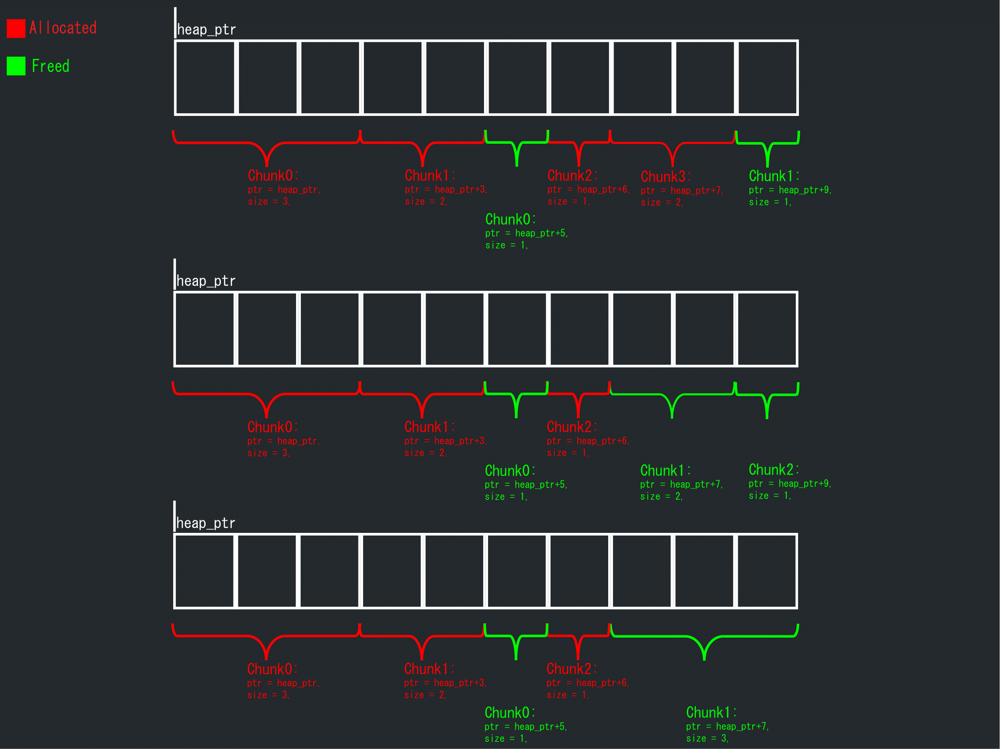

# malloc-example

malloc recreation
Изначально планировалось разобраться с работой аллокаторов. На данный момент появилась система дампов, полноценная система дебага с самотестированием, прототип системы записи логов

## Идея

Выделить некоторую память фиксированного размера(регион), на которой реализовать аллокатор общего пользования.

### Базовый принцип работы
При аллокации N байтов выделяется область в памяти размером N байтов и возвращается указатель на её начало. Структура, хранящая этот указатель и размер области(**в кол-ве машинных слов**), называется Chunk(Чанк).Чанк может быть аллоцирован(allocated) или освобожден(freed), в соответствии с этим они хранятся в 2х структурах ChunkList allocated и freed. Структура ChunkList ни что иное, как **всегда отсортированный по указателям на начало чанков** массив чанков + счетчик. 

### Аллокация
Задача аллокатора - проиттерироваться по freed, найти первый попавшийся чанк размером >= запрашиваемое число машинных слов. Затем удалить его из freed, добавить в allocated. Однако это эффективно, если размер чанка всегда совпадает с размеров запрошенным, иначе необходимо возратить излишек(хвост/tail) обратно во freed

Вместо того, чтобы удалять чанк из freed, с помощью адресной арифметики достаточно "сдвинуть" указатель вправо на размер выделенного куска, уменьшить размер на то же самое. Таким образом можно сэкономить время на удаление чанка и добавление хвоста, сортировку листа. См. подробнее в коде
### Освобождение
Задача деаллокатора - найти в allocated чанк с переданным указателем, перенести во freed. Однако может быть такая ситуация: при аллокации был отброшен излишек, теперь необходимо присоеденить его обратно(как сказано выше), иначе быстро достигнется лимит по кол-ву чанков в силу фрагментации памяти

Вместо добавления чанка в freed, найдем его хвост, с помощью адресной арифметики расширим его, таким образом можно сэкономить время на добавление и сортировку листа. См. подробнее в коде

### Дебаг
В режиме дебага в начало и конец чанков, чанк листов добавляется контрольная информация, используемая для верификации чанка (проверки на то, что он не поврежден). Проверяется наложение чанков, выход за границы. См. подробнее в коде